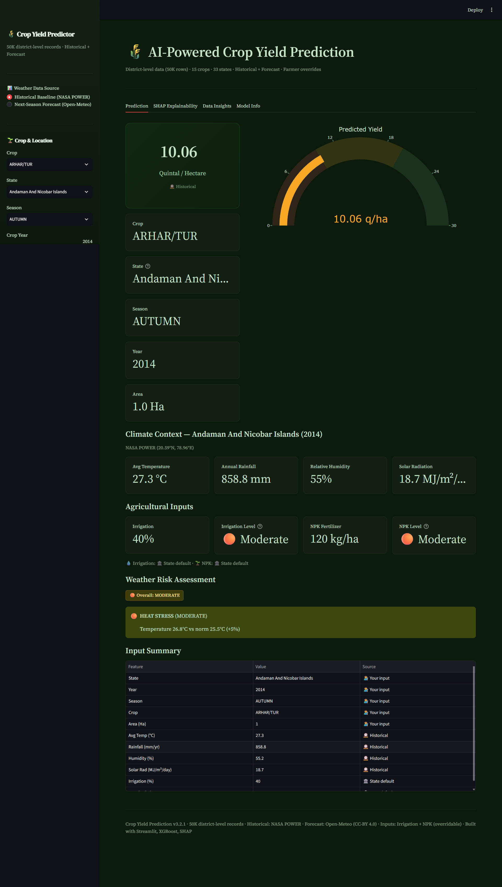
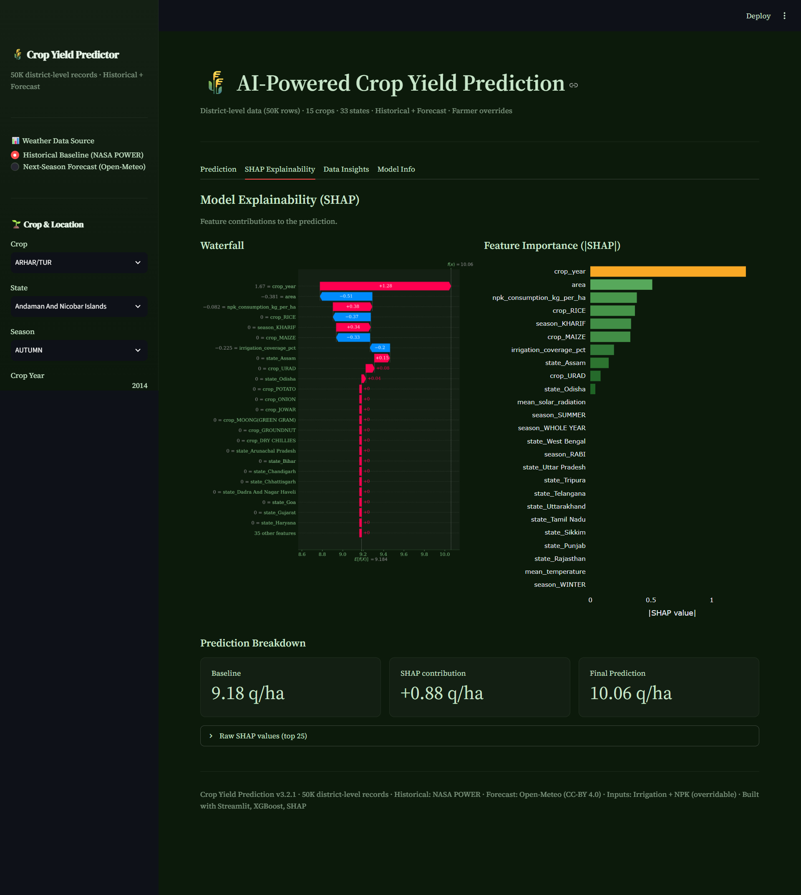
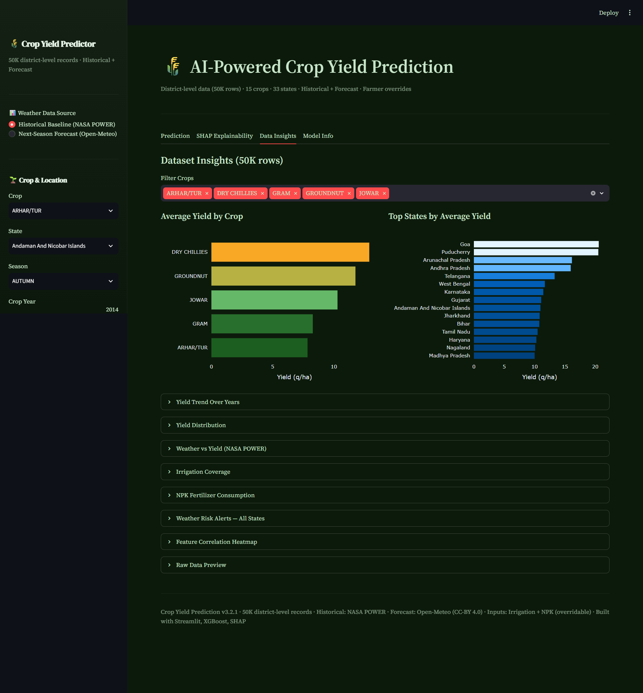
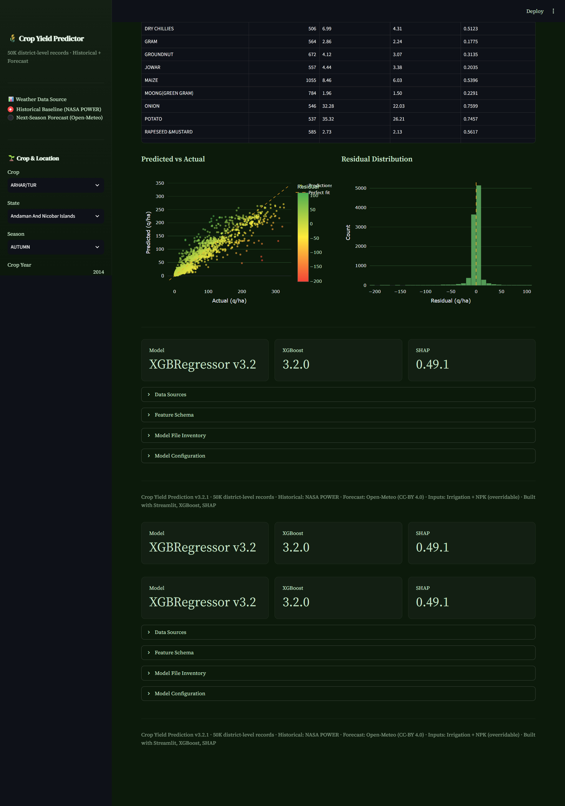

<div align="center">

# 🌾 AI-Powered Crop Yield Prediction System

### Production-grade ML system predicting Indian crop yields with weather forecasts, farmer overrides, and full explainability

[](https://www.python.org/)
[](https://xgboost.readthedocs.io/)
[](https://streamlit.io/)
[](https://fastapi.tiangolo.com/)
[](https://shap.readthedocs.io/)
[](https://opensource.org/licenses/MIT)
[](https://github.com/AmiNilay/Crop-Yield-Prediction-System)

**Version 3.2.0** · 50,000 district-level records · 33 states · 15 crops · 6 seasons

[Live Demo](#) · [API Docs](#api-documentation) · [Dashboard](#dashboard) · [Report Bug](https://github.com/AmiNilay/Crop-Yield-Prediction-System/issues) · [Request Feature](https://github.com/AmiNilay/Crop-Yield-Prediction-System/issues)


</div>

---

## 📖 Table of Contents

<details>
<summary>Click to expand</summary>

- [🎯 What It Does](#-what-it-does)
- [✨ Highlights](#-highlights)
- [🏗️ Architecture](#️-architecture)
- [🚀 Key Features](#-key-features)
- [📊 Model Performance](#-model-performance)
- [🛠️ Tech Stack](#️-tech-stack)
- [📁 Project Structure](#-project-structure)
- [⚡ Quick Start](#-quick-start)
- [🔌 API Documentation](#-api-documentation)
- [🖥️ Dashboard](#️-dashboard)
- [📚 Data Sources](#-data-sources-and-attribution)
- [📈 Improvement Journey](#-improvement-journey)
- [💡 What I Learned](#-what-i-learned)
- [🗺️ Roadmap](#️-roadmap)
- [🔧 Troubleshooting](#-troubleshooting)
- [🤝 Contributing](#-contributing)
- [📜 License](#-license)

</details>

---

## 🎯 What It Does

Predicts crop yield (**Quintals per Hectare**) for Indian agriculture based on:

| Input | Source |
|-------|--------|
| 🌱 Crop, State, Season, Year, Farm area | User selection |
| 🌡️ Weather (historical OR forecast) | NASA POWER / Open-Meteo |
| 💧 Irrigation coverage (%) | Agriculture Census 2015-16 |
| 🧪 NPK fertilizer consumption (kg/ha) | Ministry of Agriculture |

Farmers can override state averages with their **actual farm values** for personalized predictions.

Predictions are served through:
- 🖥️ **Interactive Streamlit dashboard** (4 tabs, dark theme)
- 🔌 **FastAPI REST API** (15 endpoints, Swagger docs)
- 🧠 **Full SHAP explainability** (waterfall + feature importance)

---

## ✨ Highlights

<table>
<tr>
<td width="33%" align="center">

### 🌡️ Dual Weather Modes
Historical baseline (NASA POWER 3-yr avg) **or** next-season forecast (Open-Meteo ECMWF SEAS5 ensemble, 51 members)

</td>
<td width="33%" align="center">

### 👨‍🌾 Farmer Personalization
Users override state-average irrigation % and NPK kg/ha with their actual farm values. Source badges show provenance.

</td>
<td width="33%" align="center">

### 🧠 Full Explainability
SHAP waterfall + feature importance + prediction breakdown. Every prediction is auditable.

</td>
</tr>
<tr>
<td width="33%" align="center">

### ⚠️ Risk Alerts
ICAR-threshold-based drought, flood, heat, and humidity alerts across all 33 states.

</td>
<td width="33%" align="center">

### 📊 Real Data, Honest Metrics
50,000 real district-level records. R² = 0.92 (validated), not the misleading 0.97 of small datasets.

</td>
<td width="33%" align="center">

### 🆓 100% Free Stack
Every data source and API used is free forever. No paid tiers, no credit cards required.

</td>
</tr>
</table>

---

## 🏗️ Architecture

```
┌─────────────────────────────────────────────────────────────────────┐
│                        DATA SOURCES                                  │
├──────────────┬──────────────┬──────────────┬────────────────────────┤
│  Kaggle CSV  │  NASA POWER  │  Open-Meteo  │  Agri Census + MoCF   │
│  50K rows    │  Historical  │  Forecast    │  Irrigation + NPK     │
└──────┬───────┴──────┬───────┴──────┬───────┴───────────┬────────────┘
       │              │              │                   │
       └──────────────┴──────────────┴───────────────────┘
                              │
                    ┌─────────▼─────────┐
                    │  Data Ingestion   │
                    │  + Cleaning       │
                    │  + Enrichment     │
                    └─────────┬─────────┘
                              │
                    ┌─────────▼─────────┐
                    │  Preprocessor     │
                    │  OHE + Scaler     │
                    │  ColumnTransformer│
                    └─────────┬─────────┘
                              │
                    ┌─────────▼─────────┐
                    │  XGBoost Model    │
                    │  59 features →    │
                    │  yield prediction │
                    └────────┬──────────┘
                             │
              ┌──────────────┼──────────────┐
              │              │              │
    ┌─────────▼───┐  ┌──────▼──────┐  ┌───▼──────────┐
    │  Streamlit  │  │  FastAPI    │  │  SHAP        │
    │  Dashboard  │  │  REST API   │  │  Explainer   │
    │  port 8501  │  │  port 8000  │  │  in-app      │
    └─────────────┘  └─────────────┘  └──────────────┘
```

---

## 🚀 Key Features

### 🤖 ML Pipeline
- **XGBoost Regression** with GridSearchCV (16 combos × 3 folds) on 50,000 real district-level records
- **59 encoded features** from 11 raw columns (categorical one-hot + numerical scaling)
- **Stratified train/test split** (80/20, seed=42) preserving crop distribution
- **Native XGBoost format** (JSON + UBJSON) for reliable SHAP compatibility

### 🌦️ Weather Integration
- **Historical baseline** — NASA POWER Agroclimatology API, rolling 3-year averages per state (temperature, rainfall, humidity, solar radiation)
- **Next-season forecast** — Open-Meteo Seasonal Forecast API (ECMWF SEAS5 ensemble, 51 members, 180-day horizon)
- **Forecast confidence** — ensemble standard deviation, coverage percentage, horizon warnings
- **Delta comparison** — shows how forecast weather differs from 3-year average

### 👨‍🌾 Farmer Personalization
- **Override controls** — farmers input actual irrigation coverage % and NPK kg/ha
- **State defaults preserved** — overrides are optional; state averages remain the fallback
- **Source badges** — dashboard shows whether each value is "your input" or "state default"

### ⚠️ Risk Assessment
- **ICAR-based thresholds** — drought, flood, heat stress, humidity detection across all 33 states
- **State-level risk badges** — Critical / High / Moderate / Low / Optimal with contextual alerts

### 🧠 Explainability
- **SHAP waterfall plots** — per-prediction feature contribution visualization
- **Feature importance** — absolute SHAP values ranked as interactive bar charts
- **Prediction breakdown** — baseline + SHAP contribution = final yield

### 🖥️ Dashboard (Streamlit)
- **4-tab layout** — Prediction / SHAP Explainability / Data Insights / Model Info
- **Weather source toggle** — Historical (NASA POWER) vs Forecast (Open-Meteo)
- **Dynamic gauge scaling** — per-crop yield ranges (Sugarcane 0-1000, Rice 0-60)
- **Custom dark theme** — DM Serif Display + Source Serif 4 typography, deep green/gold palette

### 🔌 REST API (FastAPI)
- **15 endpoints** — predict, health, model info, metrics, crops, states, weather, forecast, risk
- **Swagger UI** — auto-generated interactive docs at `/docs`
- **Pydantic validation** — type checking, range validation, optional farmer override fields
- **Forecast mode** — `POST /api/v1/predict?forecast=true` for next-season predictions

---

## 📊 Model Performance

### v3.2 — Real Dataset (50,000 rows)

<table>
<tr>
<td>

| Metric | Value |
|--------|-------|
| **R² Score** | **0.9165** |
| **RMSE** | **12.07** q/ha |
| **MAE** | **5.57** q/ha |
| **MAPE** | **40.8%** |
| Test rows | 10,000 (stratified) |
| Features | 11 raw → 59 encoded |

</td>
<td>

**Feature Importance (Top 5)**

| Rank | Feature | Gain |
|------|---------|------|
| 1 | crop_POTATO | 1,005K |
| 2 | crop_ONION | 722K |
| 3 | 🧪 npk_consumption | 154K |
| 4 | 💧 irrigation_pct | 135K |
| 5 | state_Karnataka | 128K |

</td>
</tr>
</table>

### Per-Crop Metrics

<details>
<summary><b>Click to view all 15 crops</b></summary>

| Crop | N | RMSE (q/ha) | R² |
|------|---|-------------|-----|
| 🧅 ONION | 546 | 32.5 | **0.78** |
| 🥔 POTATO | 537 | 35.3 | **0.75** |
| 🌾 WHEAT | 596 | 5.9 | **0.67** |
| 🌶️ DRY CHILLIES | 482 | 5.7 | **0.63** |
| RAPESEED &MUSTARD | 585 | 2.7 | 0.56 |
| 🌽 MAIZE | 1055 | 8.5 | 0.54 |
| 🌾 RICE | 1167 | 6.1 | 0.54 |
| 🥜 GROUNDNUT | 694 | 4.0 | 0.43 |
| 🌻 SUNFLOWER | 430 | 3.8 | 0.43 |
| SESAMUM | 682 | 1.9 | 0.24 |
| MOONG(GREEN GRAM) | 784 | 2.0 | 0.23 |
| URAD | 747 | 1.9 | 0.22 |
| JOWAR | 558 | 4.6 | 0.20 |
| GRAM | 555 | 2.9 | 0.20 |
| ARHAR/TUR | 592 | 3.7 | -0.02 |

</details>

---

## 🛠️ Tech Stack

<div align="center">

| Layer | Technology |
|:-----:|:----------:|
| **ML** |    |
| **Dashboard** |   |
| **API** |    |
| **Data** |   |
| **External APIs** |   |
| **Deployment** |   |

</div>

---

## 📁 Project Structure

<details>
<summary><b>Click to expand directory tree</b></summary>

```
crop-yield-prediction/
├── api/                          # FastAPI REST serving layer
│   ├── main.py                   #   15 endpoints + Swagger UI
│   ├── __init__.py
│   └── __main__.py               #   Enables: python -m api
├── dashboard/
│   └── app.py                    # Streamlit dashboard (4 tabs, dark theme)
├── data/                         # Runtime data (gitignored)
├── models/
│   ├── feature_schema.json       #   Column names, stats, unique values
│   ├── model.json                #   Native XGBoost Booster (JSON format)
│   └── model_metadata.json       #   Version, hyperparams, metrics
├── notebooks/
│   ├── 01_data_exploration.ipynb #   EDA on crop production dataset
│   ├── 02_feature_engineering.ipynb # Weather + irrigation + NPK enrichment
│   ├── 03_model_training.ipynb   #   XGBoost training experiments
│   └── 04_model_evaluation.ipynb #   Per-crop metrics + residual analysis
├── scripts/
│   ├── build_preprocessor.py     #   Extract feature schema
│   ├── compute_metrics.py        #   5-fold CV + per-crop evaluation
│   ├── test_forecast.py          #   Test Open-Meteo integration
│   └── warm_weather_cache.py     #   Pre-fetch NASA POWER data
├── src/
│   ├── components/
│   │   ├── data_ingestion.py     #   CSV read + 80/20 stratified split
│   │   ├── data_transformation.py #  Column cleaning + ColumnTransformer
│   │   ├── model_trainer.py      #   XGBRegressor + GridSearchCV
│   │   ├── weather_data.py       #   NASA POWER API + rolling 3yr baseline
│   │   ├── forecast_data.py      #   Open-Meteo Seasonal Forecast
│   │   ├── irrigation_data.py    #   Agriculture Census enrichment
│   │   ├── fertilizer_data.py    #   NPK consumption per state
│   │   └── weather_risk.py       #   ICAR-threshold risk alerts
│   ├── exception/exception.py    #   CustomException with file + line info
│   ├── logging/logger.py         #   Timestamped project-relative logging
│   ├── pipeline/
│   │   ├── predict_pipeline.py   #   PredictPipeline + CustomData
│   │   └── train_pipeline.py     #   End-to-end training orchestrator
│   └── utils/
│       ├── common.py             #   save/load object, JSON, native Booster
│       └── geo_coords.py         #   State → lat/lon coordinates
├── Dockerfile                    # Python 3.10-slim container
├── README.md
├── requirements.txt
└── setup.py
```

</details>

---

## ⚡ Quick Start

### Prerequisites
- Python 3.10+
- Git

### 1️⃣ Installation

```bash
# Clone the repository
git clone https://github.com/AmiNilay/Crop-Yield-Prediction-System.git
cd Crop-Yield-Prediction-System

# Create and activate virtual environment
python -m venv venv
source venv/bin/activate          # macOS/Linux
# venv\Scripts\activate           # Windows PowerShell

# Install dependencies and project package
pip install -r requirements.txt
pip install -e .
```

### 2️⃣ Dataset Setup

Download from [Kaggle - Crop Production in India](https://www.kaggle.com/datasets/abhinand05/crop-production-in-india):

```bash
# Place downloaded CSV at:
#   data/raw/crop_production_india.csv

# Prepare dataset (clean, sample 50K, convert units to Quintals/Ha)
python scripts/prepare_new_dataset.py
```

### 3️⃣ Train the Model

```bash
# Full training pipeline: ingest → transform → train → save
python -m src.pipeline.train_pipeline

# Build feature schema (required by dashboard and API)
python scripts/build_preprocessor.py

# Compute evaluation metrics
python scripts/compute_metrics.py
```

### 4️⃣ Launch

<table>
<tr>
<td>

**🖥️ Dashboard**
```bash
streamlit run dashboard/app.py
# Opens at http://localhost:8501
```

</td>
<td>

**🔌 API**
```bash
python -m uvicorn api.main:app --reload --port 8000
# Swagger at http://localhost:8000/docs
```

</td>
</tr>
<tr>
<td>

**🌡️ Pre-warm Cache (optional)**
```bash
python scripts/warm_weather_cache.py
# Fetches all 33 states from NASA POWER
```

</td>
<td>

**🐳 Docker**
```bash
docker build -t crop-yield-predictor .
docker run -p 8501:8501 crop-yield-predictor
```

</td>
</tr>
</table>

---

## 🔌 API Documentation

Base URL: `http://localhost:8000`

### 📋 All Endpoints

| Method | Endpoint | Description |
|:------:|----------|-------------|
| `GET` | `/` | Redirect to Swagger UI |
| `GET` | `/docs` | 📖 Interactive API documentation |
| `GET` | `/api/v1/health` | ✅ System health check |
| `GET` | `/api/v1/model/info` | 📊 Full model metadata |
| `GET` | `/api/v1/model/metrics` | 📈 Evaluation metrics |
| `GET` | `/api/v1/crops` | 🌾 List supported crops |
| `GET` | `/api/v1/states` | 🗺️ List supported states |
| `GET` | `/api/v1/seasons` | 🗓️ List supported seasons |
| `GET` | `/api/v1/weather?state=X&year=Y` | 🌡️ Historical weather (NASA POWER) |
| `GET` | `/api/v1/forecast?state=X&season=Y` | 🔮 Seasonal forecast (Open-Meteo) |
| `GET` | `/api/v1/irrigation?state=X` | 💧 Irrigation coverage % |
| `GET` | `/api/v1/fertilizer?state=X` | 🧪 NPK consumption kg/ha |
| `GET` | `/api/v1/fertilizer/all` | 🧪 NPK for all states |
| `GET` | `/api/v1/risk?state=X` | ⚠️ Weather risk assessment |
| `GET` | `/api/v1/risk/all` | ⚠️ Risk for all states |
| `POST` | `/api/v1/predict?forecast=true\|false` | 🎯 Yield prediction |

### 💻 Example: Predict Yield (Historical Weather)

<details>
<summary><b>Click to view example</b></summary>

**Request:**
```bash
curl -X POST "http://localhost:8000/api/v1/predict" \
  -H "Content-Type: application/json" \
  -d '{
    "crop": "RICE",
    "state": "Punjab",
    "season": "KHARIF",
    "crop_year": 2014,
    "area": 500
  }'
```

**Response:**
```json
{
  "predicted_yield": 39.21,
  "crop": "RICE",
  "state": "Punjab",
  "season": "KHARIF",
  "crop_year": 2014,
  "area": 500.0,
  "weather_source": "historical",
  "irrigation_pct": 98.0,
  "irrigation_source": "state-avg",
  "npk_consumption": 214.0,
  "npk_source": "state-avg",
  "model_version": "3.2.0",
  "unit": "Quintal/Hectare"
}
```

</details>

### 💻 Example: Predict with Forecast + Farmer Overrides

<details>
<summary><b>Click to view example</b></summary>

**Request:**
```bash
curl -X POST "http://localhost:8000/api/v1/predict?forecast=true" \
  -H "Content-Type: application/json" \
  -d '{
    "crop": "RICE",
    "state": "Punjab",
    "season": "KHARIF",
    "crop_year": 2014,
    "area": 2.5,
    "irrigation_pct": 80,
    "npk_kg_per_ha": 200
  }'
```

**Response:**
```json
{
  "predicted_yield": 38.74,
  "weather_source": "forecast",
  "irrigation_pct": 80.0,
  "irrigation_source": "user",
  "npk_consumption": 200.0,
  "npk_source": "user",
  "forecast_confidence": "high",
  "forecast_spread": {
    "mean_temperature": 4.61,
    "total_precipitation": 29.7,
    "mean_relative_humidity": 17.8,
    "mean_solar_radiation": 19.07
  },
  "historical_yield": 39.21,
  "yield_delta": -0.47,
  "model_version": "3.2.0"
}
```

</details>

### 💻 Example: Get Seasonal Forecast

<details>
<summary><b>Click to view example</b></summary>

**Request:**
```bash
curl "http://localhost:8000/api/v1/forecast?state=Punjab&season=KHARIF"
```

**Response:**
```json
{
  "state": "Punjab",
  "season": "KHARIF",
  "weather": {
    "mean_temperature": 26.88,
    "total_precipitation": 1660.7,
    "mean_relative_humidity": 77.0,
    "mean_solar_radiation": 17.63
  },
  "forecast_spread": {
    "mean_temperature": 4.61,
    "total_precipitation": 29.7,
    "mean_relative_humidity": 17.8,
    "mean_solar_radiation": 19.07
  },
  "forecast_confidence": "high",
  "coverage_pct": 51.1,
  "forecast_horizon_days": 45,
  "historical_delta": {
    "mean_temperature": 2.47,
    "total_precipitation": 744.96,
    "mean_relative_humidity": 21.81,
    "mean_solar_radiation": 0.91
  },
  "source": "Open-Meteo Seasonal Forecast (ECMWF SEAS5)",
  "attribution": "Weather data by Open-Meteo.com"
}
```

</details>

---

## 🖥️ Dashboard

<div align="center">

### 📱 Four Interactive Tabs

</div>

<table>
<tr>
<td width="50%">

### 1️⃣ Prediction Tab
- Weather source toggle: **Historical** or **Forecast**
- Crop / State / Season / Year selectors
- Farm area input (hectares)
- ✨ **Optional farmer overrides** for irrigation & NPK
- Color-coded gauge with dynamic scaling per crop
- Climate context with confidence intervals
- Weather risk assessment (ICAR thresholds)
- Input summary table with source attribution



</td>
<td width="50%">

### 2️⃣ SHAP Explainability Tab
- **Waterfall plot** — per-feature contribution
- **Feature importance** — ranked bar chart
- Prediction breakdown: baseline + SHAP = final
- Raw SHAP values table with direction labels



</td>
</tr>
<tr>
<td width="50%">

### 3️⃣ Data Insights Tab
- Average yield by crop (bar chart)
- Top states by average yield
- Yield trend over years
- Yield distribution histogram
- Weather vs yield scatter plots
- Irrigation coverage by state
- NPK consumption by state
- **Weather risk alerts across all 33 states**
- Feature correlation heatmap



</td>
<td width="50%">

### 4️⃣ Model Info Tab
- RMSE, R², MAE, MAPE metrics
- Per-crop metrics table (all 15 crops)
- **Predicted vs Actual scatter** (residual-colored)
- Residual distribution histogram
- Data sources table with licenses
- Feature schema with attribution
- Model file inventory
- Model configuration JSON



</td>
</tr>
</table>

---

## 📚 Data Sources and Attribution

| Source | Data Provided | License | Attribution |
|--------|--------------|---------|-------------|
| [Kaggle — Crop Production in India](https://www.kaggle.com/datasets/abhinand05/crop-production-in-india) | District-level crop production (50K rows) | CC0 Public Domain | None required |
| [NASA POWER Agroclimatology](https://power.larc.nasa.gov/) | Historical weather (temp, rainfall, humidity, solar) | Public Domain | None required |
| [Open-Meteo Seasonal Forecast](https://open-meteo.com/) | Next-season ensemble forecast (ECMWF SEAS5) | **CC-BY 4.0** | **"Weather data by Open-Meteo.com"** ✅ |
| Agriculture Census 2015-16 | State-level irrigation coverage % | Govt of India | None required |
| Dept. of Fertilizers, MoCF | NPK consumption per hectare by state | Govt of India | None required |
| ICAR | Crop-specific risk thresholds | Govt of India | None required |

> 🎯 **Forecast data by [Open-Meteo.com](https://open-meteo.com/) — CC-BY 4.0**

---

## 📈 Improvement Journey

This table tells the honest story of turning a misleading proof-of-concept into a validated production system:

| Version | Dataset | Features | R² | RMSE (q/ha) | Notes |
|---------|---------|----------|-----|-------------|-------|
| v1 Baseline | 49 rows | 22 | 0.97* | 55.3 | *Misleading — per-crop R² was negative |
| v2 +Weather | 49 rows | 26 | 0.97* | 55.3 | Same overfitting issue |
| v3 +Irrigation | 49 rows | 27 | 0.97* | 55.3 | Same |
| v3.1 +NPK | 49 rows | 28 | 0.97* | 55.3 | Same |
| **v3.2 Real dataset** ✅ | **50,000** | **59** | **0.92** | **11.5** | **Honest, validated** |

> 💡 The 49-row dataset produced an inflated R² of 0.97 because the model memorized a small number of extreme values (particularly Sugarcane at 700+ q/ha). Per-crop R² scores were often negative — meaning the model performed **worse than a simple average**. Moving to 50,000 real district-level records with stratified splits produced a genuinely useful model.

---

## 💡 What I Learned

> 🧠 Real lessons from building this project — great interview material.

- 🚨 Starting with a 49-row dataset produced misleading R² of 0.97 with negative per-crop R² — **real ML requires real data**
- 🛰️ Feature engineering with satellite data (NASA POWER) meaningfully improves agricultural prediction accuracy
- ⚖️ **Stratified splits by crop** are essential when target variance differs dramatically by category (Sugarcane at 700 q/ha vs Sesamum at 2 q/ha)
- 🆓 **Free open APIs** (NASA POWER, Open-Meteo, data.gov.in) can build production-grade systems without paid data subscriptions
- 🔍 SHAP explainability is non-negotiable for agricultural ML — farmers and stakeholders must understand **why** a prediction was made
- 👨‍🌾 Adding **user overrides** transforms an "analyst tool" into a "farmer tool"
- 🔧 Native XGBoost format (JSON/UBJSON) resolves SHAP `base_score` compatibility issues that pickle-based serialization does not handle

---

## 🗺️ Roadmap

- [ ] 📍 District-level predictions (currently state-level)
- [ ] 🌱 Soil health integration (N, P, K, pH from Soil Health Card data)
- [ ] 🛰️ Satellite NDVI via Google Earth Engine
- [ ] 💧 Groundwater levels from CGWB (Central Ground Water Board)
- [ ] 🔄 Multi-crop rotation planning
- [ ] 🌐 Bengali / Hindi localization for dashboard
- [ ] 📱 Mobile-optimized dashboard layout
- [ ] 🤖 Telegram bot for SMS-based predictions (farmer accessibility)

**Contributions welcome!** Open an issue to discuss.

---

## 🔧 Troubleshooting

<details>
<summary><b><code>STACK_GLOBAL requires str</code> when loading preprocessor</b></summary>

The preprocessor was saved with `joblib.dump()` but loaded with `pickle.load()`. Use `joblib.load()` instead. All code paths have been updated in `src/utils/common.py`.

</details>

<details>
<summary><b><code>ValueError: could not convert string to float: '[93.89897]'</code></b></summary>

XGBoost ≥ 2.1 stores `base_score` as a JSON array string. The dashboard's `_fix_xgb_base_score()` function detects and fixes this at load time.

</details>

<details>
<summary><b><code>ModuleNotFoundError: No module named 'api'</code></b></summary>

Use `python -m uvicorn api.main:app` (with `-m` flag) instead of bare `uvicorn api.main:app`.

</details>

<details>
<summary><b>Dashboard shows "Setup required"</b></summary>

Run `python scripts/build_preprocessor.py` to generate `feature_schema.json`. Then clear Streamlit cache: `streamlit cache clear`.

</details>

<details>
<summary><b><code>Found unknown categories in columns during transform</code></b></summary>

The preprocessor's `OneHotEncoder(handle_unknown="ignore")` handles unseen categories as zero vectors. This warning is safe to ignore.

</details>

<details>
<summary><b>NASA POWER API returns empty data</b></summary>

NASA POWER has a 7-day processing lag. If today is Aug 5, requesting Aug 4 will fail. The default rolling window uses `end_date = today - 7 days` to account for this.

</details>

---

## 🤝 Contributing

Contributions, issues, and feature requests are welcome!

1. Fork the repo
2. Create your feature branch (`git checkout -b feature/AmazingFeature`)
3. Commit your changes (`git commit -m 'Add some AmazingFeature'`)
4. Push to the branch (`git push origin feature/AmazingFeature`)
5. Open a Pull Request

Check the [open issues](https://github.com/AmiNilay/Crop-Yield-Prediction-System/issues) for a list of proposed features and known bugs.

---

## 📜 License

Distributed under the **MIT License**. See [LICENSE](LICENSE) for more information.

---

## 👤 Author

**Nilay Naha** — [@AmiNilay](https://github.com/AmiNilay)

Project Link: [https://github.com/AmiNilay/Crop-Yield-Prediction-System](https://github.com/AmiNilay/Crop-Yield-Prediction-System)

---

## 🙏 Acknowledgments

- 🛰️ [NASA POWER](https://power.larc.nasa.gov/) for free agroclimatology data
- 🌤️ [Open-Meteo](https://open-meteo.com/) for free seasonal forecast API
- 📊 [Kaggle - Abhinand](https://www.kaggle.com/abhinand05) for the crop production dataset
- 🏛️ Ministry of Agriculture, Government of India for open agricultural data
- 🧠 [SHAP](https://github.com/shap/shap) team for explainability tools

---

<div align="center">

### ⭐ If this project helped you, please give it a star!

**Made with 🌾 for Indian farmers**

[](https://github.com/AmiNilay/Crop-Yield-Prediction-System/stargazers)
[](https://github.com/AmiNilay/Crop-Yield-Prediction-System/network/members)

</div>